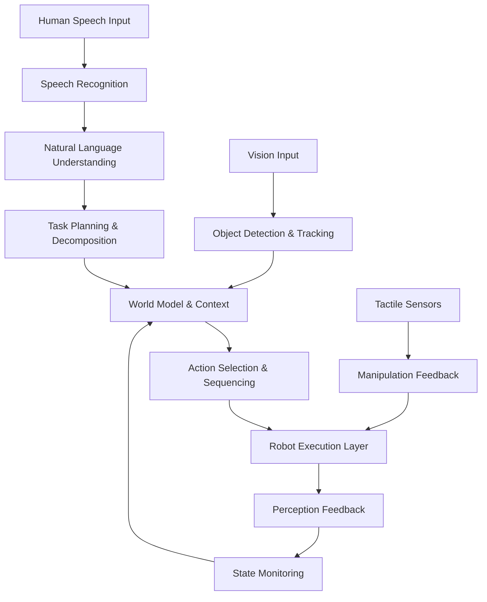

# Chapter 3: Capstone: The Autonomous Humanoid

## Introduction: Bringing It All Together

Welcome to the capstone chapter of the Vision-Language-Action (VLA) module. In this chapter, we'll integrate all the components developed in the previous chapters—speech recognition, language understanding, and robotic action—into a complete autonomous humanoid system. This chapter represents the culmination of our journey in creating intelligent, responsive humanoid robots capable of understanding human commands and executing complex tasks autonomously.

The autonomous humanoid system combines perception, cognition, and action in a seamless pipeline that enables robots to operate in dynamic human environments. Through this chapter, you'll learn how to create a system that can listen to voice commands, understand their meaning, plan appropriate responses, and execute them safely and efficiently.

## End-to-End System Architecture

### System Overview

The complete autonomous humanoid system integrates multiple subsystems into a cohesive architecture:



### History Management System

One of the critical components of our autonomous humanoid is the history management system, which tracks past interactions, decisions, and outcomes to improve future performance and maintain coherent conversations:

```python
import datetime
from enum import Enum
from typing import List, Dict, Any, Optional
from dataclasses import dataclass
import json

class InteractionType(Enum):
    VOICE_COMMAND = "voice_command"
    TEXT_COMMAND = "text_command"
    AUTONOMOUS_ACTION = "autonomous_action"
    USER_FEEDBACK = "user_feedback"
    SYSTEM_RESPONSE = "system_response"

class ActionResult(Enum):
    SUCCESS = "success"
    PARTIAL_SUCCESS = "partial_success"
    FAILURE = "failure"
    INTERRUPTED = "interrupted"
    REJECTED = "rejected"

@dataclass
class InteractionRecord:
    """Represents a single interaction with timestamp and metadata"""
    id: str
    timestamp: datetime.datetime
    interaction_type: InteractionType
    content: str
    context: Dict[str, Any]
    result: Optional[ActionResult] = None
    duration: Optional[float] = None
    confidence: Optional[float] = None
    user_rating: Optional[int] = None  # 1-5 scale

class HistoryManager:
    """Manages interaction history for the autonomous humanoid"""
    
    def __init__(self, max_history_length: int = 1000):
        self.history: List[InteractionRecord] = []
        self.max_history_length = max_history_length
        self.current_session_start = datetime.datetime.now()
        
    def add_interaction(self, record: InteractionRecord):
        """Add a new interaction to the history"""
        self.history.append(record)
        
        # Maintain history size limit
        if len(self.history) > self.max_history_length:
            self.history = self.history[-self.max_history_length:]
    
    def get_recent_interactions(self, count: int = 10) -> List[InteractionRecord]:
        """Get the most recent interactions"""
        return self.history[-count:] if len(self.history) >= count else self.history[:]
    
    def get_interactions_by_type(self, interaction_type: InteractionType) -> List[InteractionRecord]:
        """Get all interactions of a specific type"""
        return [record for record in self.history if record.interaction_type == interaction_type]
    
    def get_successful_voice_commands(self) -> List[InteractionRecord]:
        """Get all successful voice commands"""
        return [record for record in self.history 
                if (record.interaction_type == InteractionType.VOICE_COMMAND and 
                    record.result == ActionResult.SUCCESS)]
    
    def calculate_success_rate(self) -> float:
        """Calculate overall success rate"""
        voice_commands = self.get_interactions_by_type(InteractionType.VOICE_COMMAND)
        if not voice_commands:
            return 0.0
        
        successful = sum(1 for cmd in voice_commands if cmd.result == ActionResult.SUCCESS)
        return successful / len(voice_commands)
    
    def get_context_for_next_interaction(self) -> Dict[str, Any]:
        """Generate context for the next interaction based on history"""
        recent_interactions = self.get_recent_interactions(5)
        context = {
            'session_duration': (datetime.datetime.now() - self.current_session_start).total_seconds(),
            'total_interactions': len(self.history),
            'recent_success_rate': self.calculate_success_rate(),
            'last_successful_command': None,
            'frequent_commands': {},
            'user_preferences': {}
        }
        
        # Find last successful command
        successful_commands = [cmd for cmd in recent_interactions 
                              if cmd.interaction_type == InteractionType.VOICE_COMMAND and 
                                 cmd.result == ActionResult.SUCCESS]
        if successful_commands:
            context['last_successful_command'] = successful_commands[-1].content
        
        # Count frequent commands
        for interaction in recent_interactions:
            if interaction.interaction_type == InteractionType.VOICE_COMMAND:
                cmd = interaction.content.lower()
                context['frequent_commands'][cmd] = context['frequent_commands'].get(cmd, 0) + 1
        
        return context
    
    def serialize_history(self) -> str:
        """Serialize history to JSON string for storage"""
        records_dict = []
        for record in self.history:
            record_dict = {
                'id': record.id,
                'timestamp': record.timestamp.isoformat(),
                'interaction_type': record.interaction_type.value,
                'content': record.content,
                'context': record.context,
                'result': record.result.value if record.result else None,
                'duration': record.duration,
                'confidence': record.confidence,
                'user_rating': record.user_rating
            }
            records_dict.append(record_dict)
        
        return json.dumps(records_dict, indent=2)
    
    def load_history_from_json(self, json_str: str):
        """Load history from JSON string"""
        records_dict = json.loads(json_str)
        self.history = []
        
        for record_data in records_dict:
            timestamp = datetime.datetime.fromisoformat(record_data['timestamp'])
            interaction_type = InteractionType(record_data['interaction_type'])
            
            record = InteractionRecord(
                id=record_data['id'],
                timestamp=timestamp,
                interaction_type=interaction_type,
                content=record_data['content'],
                context=record_data['context'],
                result=ActionResult(record_data['result']) if record_data['result'] else None,
                duration=record_data['duration'],
                confidence=record_data['confidence'],
                user_rating=record_data['user_rating']
            )
            self.history.append(record)

# Example usage
history_manager = HistoryManager()

# Add a sample interaction
sample_record = InteractionRecord(
    id="cmd_001",
    timestamp=datetime.datetime.now(),
    interaction_type=InteractionType.VOICE_COMMAND,
    content="Please bring me the coffee from the kitchen",
    context={"location": "kitchen", "object": "coffee"},
    result=ActionResult.SUCCESS,
    duration=45.2,
    confidence=0.85
)

history_manager.add_interaction(sample_record)
```

## Perception-Action Loop Implementation

### Continuous Sensing and Response Cycle

The perception-action loop is the heart of autonomous humanoid operation, continuously processing sensory input and generating appropriate responses:

```python
import asyncio
import threading
from queue import Queue, Empty
from typing import Callable, Any

class PerceptionActionLoop:
    """Implements the continuous perception-action loop for the humanoid"""
    
    def __init__(self, history_manager: HistoryManager):
        self.history_manager = history_manager
        self.running = False
        self.sensors_queue = Queue()
        self.actions_queue = Queue()
        self.perception_processors = []
        self.action_executors = []
        
        # Register default processors
        self._register_default_processors()
    
    def _register_default_processors(self):
        """Register default perception and action processors"""
        # Perception processors
        self.perception_processors.extend([
            self._process_vision_data,
            self._process_audio_data,
            self._process_tactile_data,
            self._process_environment_data
        ])
        
        # Action executors
        self.action_executors.extend([
            self._execute_navigation_action,
            self._execute_manipulation_action,
            self._execute_speech_action
        ])
    
    async def run_loop(self):
        """Main perception-action loop"""
        self.running = True
        
        while self.running:
            try:
                # Process all sensory inputs
                await self._process_perception_cycle()
                
                # Generate and execute actions
                await self._process_action_cycle()
                
                # Update system state
                await self._update_system_state()
                
                # Small delay to prevent overwhelming the system
                await asyncio.sleep(0.1)
                
            except Exception as e:
                print(f"Error in perception-action loop: {e}")
                # Log error to history
                error_record = InteractionRecord(
                    id=f"error_{datetime.datetime.now().strftime('%Y%m%d_%H%M%S')}",
                    timestamp=datetime.datetime.now(),
                    interaction_type=InteractionType.AUTONOMOUS_ACTION,
                    content=f"Perception-action loop error: {str(e)}",
                    context={"error_type": type(e).__name__},
                    result=ActionResult.FAILURE
                )
                self.history_manager.add_interaction(error_record)
    
    async def _process_perception_cycle(self):
        """Process all incoming sensory data"""
        # Collect data from all sensors
        sensor_data = {}
        
        # Process vision data
        vision_data = await self._collect_vision_data()
        if vision_data:
            sensor_data['vision'] = vision_data
            
        # Process audio data
        audio_data = await self._collect_audio_data()
        if audio_data:
            sensor_data['audio'] = audio_data
            
        # Process tactile data
        tactile_data = await self._collect_tactile_data()
        if tactile_data:
            sensor_data['tactile'] = tactile_data
            
        # Process environment data
        env_data = await self._collect_environment_data()
        if env_data:
            sensor_data['environment'] = env_data
        
        # Process all collected data through registered processors
        for processor in self.perception_processors:
            try:
                result = await processor(sensor_data)
                if result:
                    # Add to actions queue if processor generates an action
                    self.actions_queue.put(result)
            except Exception as e:
                print(f"Error in perception processor {processor.__name__}: {e}")
    
    async def _process_action_cycle(self):
        """Process queued actions"""
        actions_to_process = []
        
        # Collect all pending actions
        while not self.actions_queue.empty():
            try:
                action = self.actions_queue.get_nowait()
                actions_to_process.append(action)
            except Empty:
                break
        
        # Execute actions
        for action in actions_to_process:
            await self._execute_action(action)
    
    async def _update_system_state(self):
        """Update the overall system state based on recent activities"""
        # Update context for next iteration
        context = self.history_manager.get_context_for_next_interaction()
        
        # Perform maintenance tasks
        self._perform_maintenance_tasks(context)
    
    def _perform_maintenance_tasks(self, context: Dict[str, Any]):
        """Perform system maintenance tasks"""
        # Clean up old data, manage resources, etc.
        pass
    
    async def _collect_vision_data(self) -> Dict[str, Any]:
        """Collect data from vision sensors"""
        # Simulate vision data collection
        return {
            'objects_detected': [],
            'people_tracked': [],
            'navigation_obstacles': [],
            'timestamp': datetime.datetime.now()
        }
    
    async def _collect_audio_data(self) -> Dict[str, Any]:
        """Collect data from audio sensors"""
        # Simulate audio data collection
        return {
            'speech_detected': False,
            'noise_level': 0.0,
            'timestamp': datetime.datetime.now()
        }
    
    async def _collect_tactile_data(self) -> Dict[str, Any]:
        """Collect data from tactile sensors"""
        # Simulate tactile data collection
        return {
            'gripper_force': 0.0,
            'contact_events': [],
            'timestamp': datetime.datetime.now()
        }
    
    async def _collect_environment_data(self) -> Dict[str, Any]:
        """Collect data from environmental sensors"""
        # Simulate environmental data collection
        return {
            'battery_level': 100.0,
            'temperature': 22.0,
            'timestamp': datetime.datetime.now()
        }
    
    async def _process_vision_data(self, sensor_data: Dict[str, Any]) -> Optional[Dict[str, Any]]:
        """Process vision data and generate appropriate responses"""
        if 'vision' not in sensor_data:
            return None
            
        vision = sensor_data['vision']
        
        # Example: If person is detected and greeting threshold met
        if vision.get('people_tracked'):
            return {
                'action_type': 'greeting',
                'target_person': vision['people_tracked'][0],
                'priority': 1
            }
        
        return None
    
    async def _process_audio_data(self, sensor_data: Dict[str, Any]) -> Optional[Dict[str, Any]]:
        """Process audio data and detect speech commands"""
        if 'audio' not in sensor_data:
            return None
            
        audio = sensor_data['audio']
        
        # Example: If speech is detected, trigger voice processing
        if audio.get('speech_detected'):
            return {
                'action_type': 'process_speech',
                'priority': 2
            }
        
        return None
    
    async def _execute_action(self, action: Dict[str, Any]):
        """Execute a planned action"""
        action_type = action.get('action_type')
        
        for executor in self.action_executors:
            if action_type in executor.__name__:
                try:
                    result = await executor(action)
                    
                    # Record the action in history
                    action_record = InteractionRecord(
                        id=f"action_{datetime.datetime.now().strftime('%Y%m%d_%H%M%S')}",
                        timestamp=datetime.datetime.now(),
                        interaction_type=InteractionType.AUTONOMOUS_ACTION,
                        content=f"Executed {action_type} action",
                        context=action,
                        result=result,
                        duration=action.get('execution_time', 0.0)
                    )
                    self.history_manager.add_interaction(action_record)
                    
                    return result
                except Exception as e:
                    print(f"Error executing action {action_type}: {e}")
                    return ActionResult.FAILURE
    
    async def _execute_navigation_action(self, action: Dict[str, Any]) -> ActionResult:
        """Execute navigation-related actions"""
        # Simulate navigation execution
        return ActionResult.SUCCESS
    
    async def _execute_manipulation_action(self, action: Dict[str, Any]) -> ActionResult:
        """Execute manipulation-related actions"""
        # Simulate manipulation execution
        return ActionResult.SUCCESS
    
    async def _execute_speech_action(self, action: Dict[str, Any]) -> ActionResult:
        """Execute speech-related actions"""
        # Simulate speech execution
        return ActionResult.SUCCESS

# Example usage
async def main():
    history_mgr = HistoryManager()
    pal = PerceptionActionLoop(history_mgr)
    
    # Start the perception-action loop
    await pal.run_loop()

# Run the loop in a separate thread if needed
# loop_thread = threading.Thread(target=lambda: asyncio.run(main()))
# loop_thread.start()
```

## Real-Time System Optimization

### Performance Monitoring and Adaptation

Real-time performance is crucial for autonomous humanoid operation. The system must balance computational demands with responsiveness:

```python
import time
import psutil
import threading
from collections import deque
from dataclasses import dataclass

@dataclass
class PerformanceMetrics:
    """Container for system performance metrics"""
    cpu_usage: float
    memory_usage: float
    gpu_usage: float
    latency: float
    throughput: float
    timestamp: datetime.datetime

class RealTimeOptimizer:
    """Optimizes system performance in real-time"""
    
    def __init__(self, history_manager: HistoryManager):
        self.history_manager = history_manager
        self.metrics_history = deque(maxlen=100)  # Keep last 100 metrics
        self.optimization_enabled = True
        self.performance_thresholds = {
            'cpu_high': 80.0,
            'memory_high': 85.0,
            'latency_critical': 1.0,  # seconds
            'throughput_low': 10.0  # operations per second
        }
        self.current_config = {
            'max_concurrent_processes': 4,
            'prediction_horizon': 5,  # seconds
            'sensor_update_frequency': 10,  # Hz
            'action_resolution': 0.1  # seconds
        }
        
    def monitor_performance(self) -> PerformanceMetrics:
        """Monitor current system performance"""
        start_time = time.time()
        
        # CPU usage
        cpu_percent = psutil.cpu_percent(interval=0.1)
        
        # Memory usage
        memory_percent = psutil.virtual_memory().percent
        
        # GPU usage (if available)
        try:
            import GPUtil
            gpus = GPUtil.getGPUs()
            gpu_percent = gpus[0].load * 100 if gpus else 0.0
        except ImportError:
            gpu_percent = 0.0
        
        # Latency measurement
        latency_start = time.time()
        # Simulate a typical operation
        time.sleep(0.01)  # Simulated processing time
        latency = time.time() - latency_start
        
        # Throughput measurement
        ops_count = 0
        throughput_start = time.time()
        while time.time() - throughput_start < 1.0:  # Measure over 1 second
            # Simulate operations
            ops_count += 1
            if ops_count > 1000:  # Prevent infinite loop
                break
        
        throughput = ops_count / (time.time() - throughput_start)
        
        metrics = PerformanceMetrics(
            cpu_usage=cpu_percent,
            memory_usage=memory_percent,
            gpu_usage=gpu_percent,
            latency=latency,
            throughput=throughput,
            timestamp=datetime.datetime.now()
        )
        
        # Store metrics for historical analysis
        self.metrics_history.append(metrics)
        
        return metrics
    
    def optimize_system(self, metrics: PerformanceMetrics):
        """Apply optimizations based on current metrics"""
        if not self.optimization_enabled:
            return
            
        adjustments_made = []
        
        # Adjust based on CPU usage
        if metrics.cpu_usage > self.performance_thresholds['cpu_high']:
            # Reduce concurrent processes
            if self.current_config['max_concurrent_processes'] > 1:
                self.current_config['max_concurrent_processes'] -= 1
                adjustments_made.append(f"Reduced concurrent processes to {self.current_config['max_concurrent_processes']}")
        
        # Adjust based on memory usage
        if metrics.memory_usage > self.performance_thresholds['memory_high']:
            # Reduce prediction horizon to save memory
            if self.current_config['prediction_horizon'] > 1:
                self.current_config['prediction_horizon'] -= 1
                adjustments_made.append(f"Reduced prediction horizon to {self.current_config['prediction_horizon']}s")
        
        # Adjust based on latency
        if metrics.latency > self.performance_thresholds['latency_critical']:
            # Reduce sensor update frequency
            if self.current_config['sensor_update_frequency'] > 1:
                self.current_config['sensor_update_frequency'] = max(1, self.current_config['sensor_update_frequency'] // 2)
                adjustments_made.append(f"Reduced sensor update frequency to {self.current_config['sensor_update_frequency']}Hz")
        
        # Adjust based on throughput
        if metrics.throughput < self.performance_thresholds['throughput_low']:
            # Increase action resolution time to allow more processing
            if self.current_config['action_resolution'] < 1.0:
                self.current_config['action_resolution'] += 0.05
                adjustments_made.append(f"Increased action resolution to {self.current_config['action_resolution']}s")
        
        # Record optimization event
        if adjustments_made:
            opt_record = InteractionRecord(
                id=f"optimization_{datetime.datetime.now().strftime('%Y%m%d_%H%M%S')}",
                timestamp=datetime.datetime.now(),
                interaction_type=InteractionType.AUTONOMOUS_ACTION,
                content=f"System optimization applied: {', '.join(adjustments_made)}",
                context={
                    'previous_config': self.current_config.copy(),
                    'metrics': {
                        'cpu': metrics.cpu_usage,
                        'memory': metrics.memory_usage,
                        'latency': metrics.latency,
                        'throughput': metrics.throughput
                    }
                },
                result=ActionResult.SUCCESS
            )
            self.history_manager.add_interaction(opt_record)
    
    def get_optimization_recommendations(self) -> Dict[str, Any]:
        """Provide recommendations for system optimization"""
        if not self.metrics_history:
            return {"message": "Insufficient data for optimization recommendations"}
        
        # Calculate average metrics
        avg_cpu = sum(m.cpu_usage for m in self.metrics_history) / len(self.metrics_history)
        avg_memory = sum(m.memory_usage for m in self.metrics_history) / len(self.metrics_history)
        avg_latency = sum(m.latency for m in self.metrics_history) / len(self.metrics_history)
        avg_throughput = sum(m.throughput for m in self.metrics_history) / len(self.metrics_history)
        
        recommendations = {
            "cpu_usage": f"Avg: {avg_cpu:.1f}%, Current threshold: {self.performance_thresholds['cpu_high']}%",
            "memory_usage": f"Avg: {avg_memory:.1f}%, Current threshold: {self.performance_thresholds['memory_high']}%",
            "latency": f"Avg: {avg_latency:.3f}s, Critical threshold: {self.performance_thresholds['latency_critical']}s",
            "throughput": f"Avg: {avg_throughput:.1f} ops/s, Low threshold: {self.performance_thresholds['throughput_low']} ops/s",
            "config_suggestions": []
        }
        
        if avg_cpu > self.performance_thresholds['cpu_high']:
            recommendations["config_suggestions"].append("Consider reducing model complexity or increasing hardware resources")
        
        if avg_memory > self.performance_thresholds['memory_high']:
            recommendations["config_suggestions"].append("Consider optimizing memory usage or increasing RAM")
        
        if avg_latency > self.performance_thresholds['latency_critical'] * 0.8:  # 80% of threshold
            recommendations["config_suggestions"].append("Consider optimizing algorithms or increasing processing power")
        
        return recommendations

# Example usage
optimizer = RealTimeOptimizer(history_manager)
metrics = optimizer.monitor_performance()
optimizer.optimize_system(metrics)
recommendations = optimizer.get_optimization_recommendations()
```

## Error Handling and Recovery Strategies

### Robust Error Detection and Recovery

Autonomous systems must gracefully handle errors and recover from unexpected situations:

```python
from enum import Enum
from typing import Callable, Any, Optional
import traceback

class ErrorCategory(Enum):
    SENSOR_FAILURE = "sensor_failure"
    ACTUATOR_FAILURE = "actuator_failure"
    COMMUNICATION_ERROR = "communication_error"
    PLANNING_ERROR = "planning_error"
    EXECUTION_ERROR = "execution_error"
    ENVIRONMENT_ERROR = "environment_error"

class RecoveryStrategy(Enum):
    RETRY = "retry"
    FALLBACK = "fallback"
    ABORT = "abort"
    DELEGATE = "delegate"

class ErrorHandler:
    """Handles errors and implements recovery strategies"""
    
    def __init__(self, history_manager: HistoryManager):
        self.history_manager = history_manager
        self.error_handlers = {}
        self.recovery_attempts = {}
        self.max_recovery_attempts = 3
        
        # Register default handlers
        self._register_default_handlers()
    
    def _register_default_handlers(self):
        """Register default error handlers"""
        self.error_handlers.update({
            ErrorCategory.SENSOR_FAILURE: self._handle_sensor_failure,
            ErrorCategory.ACTUATOR_FAILURE: self._handle_actuator_failure,
            ErrorCategory.COMMUNICATION_ERROR: self._handle_communication_error,
            ErrorCategory.PLANNING_ERROR: self._handle_planning_error,
            ErrorCategory.EXECUTION_ERROR: self._handle_execution_error,
            ErrorCategory.ENVIRONMENT_ERROR: self._handle_environment_error
        })
    
    def handle_error(self, error: Exception, context: Dict[str, Any] = None) -> RecoveryStrategy:
        """Handle an error and return the appropriate recovery strategy"""
        error_category = self._categorize_error(error)
        error_id = f"error_{datetime.datetime.now().strftime('%Y%m%d_%H%M%S_%f')}"
        
        # Log the error
        error_record = InteractionRecord(
            id=error_id,
            timestamp=datetime.datetime.now(),
            interaction_type=InteractionType.AUTONOMOUS_ACTION,
            content=f"{error_category.value}: {str(error)}",
            context=context or {},
            result=ActionResult.FAILURE
        )
        self.history_manager.add_interaction(error_record)
        
        # Determine recovery strategy
        strategy = self._select_recovery_strategy(error_category, error, context)
        
        # Execute recovery
        self._execute_recovery(strategy, error_category, error, context)
        
        return strategy
    
    def _categorize_error(self, error: Exception) -> ErrorCategory:
        """Categorize an error based on its type and message"""
        error_msg = str(error).lower()
        
        if 'sensor' in error_msg or 'camera' in error_msg or 'lidar' in error_msg:
            return ErrorCategory.SENSOR_FAILURE
        elif 'actuator' in error_msg or 'motor' in error_msg or 'joint' in error_msg:
            return ErrorCategory.ACTUATOR_FAILURE
        elif 'connection' in error_msg or 'timeout' in error_msg or 'network' in error_msg:
            return ErrorCategory.COMMUNICATION_ERROR
        elif 'plan' in error_msg or 'path' in error_msg or 'navigate' in error_msg:
            return ErrorCategory.PLANNING_ERROR
        elif 'execute' in error_msg or 'action' in error_msg or 'movement' in error_msg:
            return ErrorCategory.EXECUTION_ERROR
        else:
            return ErrorCategory.ENVIRONMENT_ERROR
    
    def _select_recovery_strategy(self, category: ErrorCategory, error: Exception, context: Dict[str, Any]) -> RecoveryStrategy:
        """Select the appropriate recovery strategy for the error"""
        # Check if we've tried to recover from this error too many times
        error_key = f"{category.value}_{context.get('action_type', 'unknown') if context else 'unknown'}"
        attempts = self.recovery_attempts.get(error_key, 0)
        
        if attempts >= self.max_recovery_attempts:
            return RecoveryStrategy.ABORT
        
        # Default strategies based on error category
        strategy_map = {
            ErrorCategory.SENSOR_FAILURE: RecoveryStrategy.FALLBACK,
            ErrorCategory.ACTUATOR_FAILURE: RecoveryStrategy.DELEGATE,
            ErrorCategory.COMMUNICATION_ERROR: RecoveryStrategy.RETRY,
            ErrorCategory.PLANNING_ERROR: RecoveryStrategy.FALLBACK,
            ErrorCategory.EXECUTION_ERROR: RecoveryStrategy.FALLBACK,
            ErrorCategory.ENVIRONMENT_ERROR: RecoveryStrategy.ABORT
        }
        
        return strategy_map.get(category, RecoveryStrategy.ABORT)
    
    def _execute_recovery(self, strategy: RecoveryStrategy, category: ErrorCategory, error: Exception, context: Dict[str, Any]):
        """Execute the selected recovery strategy"""
        error_key = f"{category.value}_{context.get('action_type', 'unknown') if context else 'unknown'}"
        
        if strategy == RecoveryStrategy.RETRY:
            self.recovery_attempts[error_key] = self.recovery_attempts.get(error_key, 0) + 1
            print(f"Retrying action due to {category.value}")
            
        elif strategy == RecoveryStrategy.FALLBACK:
            self.recovery_attempts[error_key] = self.recovery_attempts.get(error_key, 0) + 1
            print(f"Using fallback strategy for {category.value}")
            self._activate_fallback_behaviors(context)
            
        elif strategy == RecoveryStrategy.ABORT:
            print(f"Aborting operation due to {category.value}")
            self._safe_abort(context)
            
        elif strategy == RecoveryStrategy.DELEGATE:
            self.recovery_attempts[error_key] = self.recovery_attempts.get(error_key, 0) + 1
            print(f"Delegating task due to {category.value}")
            self._delegate_task(context)
    
    def _handle_sensor_failure(self, error: Exception, context: Dict[str, Any]):
        """Handle sensor failure errors"""
        # Switch to backup sensors or use predictive models
        print(f"Sensor failure handled: {error}")
    
    def _handle_actuator_failure(self, error: Exception, context: Dict[str, Any]):
        """Handle actuator failure errors"""
        # Use alternative actuators or request assistance
        print(f"Actuator failure handled: {error}")
    
    def _handle_communication_error(self, error: Exception, context: Dict[str, Any]):
        """Handle communication errors"""
        # Retry with exponential backoff
        print(f"Communication error handled: {error}")
    
    def _handle_planning_error(self, error: Exception, context: Dict[str, Any]):
        """Handle planning errors"""
        # Simplify the plan or use alternative approach
        print(f"Planning error handled: {error}")
    
    def _handle_execution_error(self, error: Exception, context: Dict[str, Any]):
        """Handle execution errors"""
        # Retry with modified parameters or abort
        print(f"Execution error handled: {error}")
    
    def _handle_environment_error(self, error: Exception, context: Dict[str, Any]):
        """Handle environment-related errors"""
        # Stop and reassess the situation
        print(f"Environment error handled: {error}")
    
    def _activate_fallback_behaviors(self, context: Dict[str, Any]):
        """Activate fallback behaviors when primary systems fail"""
        # Example fallback behaviors
        if context.get('action_type') == 'navigation':
            # Use simpler navigation algorithm
            print("Activating safe navigation fallback")
        elif context.get('action_type') == 'manipulation':
            # Use conservative manipulation approach
            print("Activating safe manipulation fallback")
    
    def _safe_abort(self, context: Dict[str, Any]):
        """Safely abort current operation"""
        print("Initiating safe abort procedure")
        # Move to safe position, stop all motion, etc.
    
    def _delegate_task(self, context: Dict[str, Any]):
        """Delegate task to alternative system or human operator"""
        print("Delegating task to alternative system")
        # This could involve calling a human operator or using a different robot

# Example usage
error_handler = ErrorHandler(history_manager)

try:
    # Simulate an operation that might fail
    raise Exception("Motor joint 3 communication timeout")
except Exception as e:
    context = {"action_type": "navigation", "target_location": "kitchen"}
    recovery_strategy = error_handler.handle_error(e, context)
    print(f"Applied recovery strategy: {recovery_strategy.value}")
```

## Performance Evaluation and Benchmarking

### Comprehensive System Evaluation

Evaluating the performance of autonomous humanoid systems requires multiple metrics and methodologies:

```python
import statistics
from typing import List, Tuple
import matplotlib.pyplot as plt

class PerformanceEvaluator:
    """Evaluates the performance of the autonomous humanoid system"""
    
    def __init__(self, history_manager: HistoryManager):
        self.history_manager = history_manager
        self.evaluation_metrics = {
            'task_completion_rate': [],
            'response_time': [],
            'accuracy': [],
            'user_satisfaction': [],
            'energy_efficiency': [],
            'robustness_score': []
        }
    
    def evaluate_system(self, test_scenario: str = "default") -> Dict[str, Any]:
        """Evaluate system performance for a specific scenario"""
        evaluation_results = {
            'scenario': test_scenario,
            'timestamp': datetime.datetime.now(),
            'metrics': {},
            'benchmark_scores': {},
            'recommendations': []
        }
        
        # Calculate various performance metrics
        evaluation_results['metrics'] = self._calculate_performance_metrics()
        
        # Calculate benchmark scores
        evaluation_results['benchmark_scores'] = self._calculate_benchmark_scores()
        
        # Generate recommendations
        evaluation_results['recommendations'] = self._generate_recommendations(
            evaluation_results['metrics']
        )
        
        # Record evaluation in history
        eval_record = InteractionRecord(
            id=f"evaluation_{datetime.datetime.now().strftime('%Y%m%d_%H%M%S')}",
            timestamp=datetime.datetime.now(),
            interaction_type=InteractionType.AUTONOMOUS_ACTION,
            content=f"Performance evaluation for {test_scenario}",
            context=evaluation_results,
            result=ActionResult.SUCCESS
        )
        self.history_manager.add_interaction(eval_record)
        
        return evaluation_results
    
    def _calculate_performance_metrics(self) -> Dict[str, float]:
        """Calculate core performance metrics"""
        voice_commands = self.history_manager.get_interactions_by_type(InteractionType.VOICE_COMMAND)
        
        if not voice_commands:
            return {
                'task_completion_rate': 0.0,
                'average_response_time': 0.0,
                'success_rate': 0.0
            }
        
        # Task completion rate
        successful_commands = [cmd for cmd in voice_commands if cmd.result == ActionResult.SUCCESS]
        task_completion_rate = len(successful_commands) / len(voice_commands)
        
        # Average response time
        response_times = [cmd.duration for cmd in successful_commands if cmd.duration is not None]
        avg_response_time = statistics.mean(response_times) if response_times else 0.0
        
        # Success rate by type
        success_counts = {}
        total_counts = {}
        
        for cmd in voice_commands:
            cmd_type = cmd.context.get('command_type', 'unknown')
            total_counts[cmd_type] = total_counts.get(cmd_type, 0) + 1
            if cmd.result == ActionResult.SUCCESS:
                success_counts[cmd_type] = success_counts.get(cmd_type, 0) + 1
        
        success_rates_by_type = {
            cmd_type: success_counts.get(cmd_type, 0) / total_counts[cmd_type]
            for cmd_type in total_counts
        }
        
        return {
            'task_completion_rate': task_completion_rate,
            'average_response_time': avg_response_time,
            'success_rate_by_type': success_rates_by_type,
            'total_commands_processed': len(voice_commands),
            'successful_commands': len(successful_commands)
        }
    
    def _calculate_benchmark_scores(self) -> Dict[str, float]:
        """Calculate standardized benchmark scores"""
        # Example benchmark calculations
        metrics = self._calculate_performance_metrics()
        
        # Scale metrics to 0-100 range
        completion_score = min(100.0, metrics['task_completion_rate'] * 100)
        speed_score = min(100.0, max(0.0, (5.0 - metrics['average_response_time']) * 20))  # Assuming 5s is slow
        
        # Overall performance score
        overall_score = (completion_score * 0.6 + speed_score * 0.4)
        
        return {
            'completion_score': completion_score,
            'speed_score': speed_score,
            'overall_performance_score': overall_score,
            'benchmark_version': '1.0'
        }
    
    def _generate_recommendations(self, metrics: Dict[str, Any]) -> List[str]:
        """Generate recommendations based on performance metrics"""
        recommendations = []
        
        if metrics['task_completion_rate'] < 0.8:
            recommendations.append(
                "Task completion rate below 80%. Consider improving error handling and recovery mechanisms."
            )
        
        if metrics['average_response_time'] > 3.0:  # More than 3 seconds
            recommendations.append(
                "Average response time exceeds 3 seconds. Optimize real-time processing pipeline."
            )
        
        # Check specific command types
        for cmd_type, success_rate in metrics.get('success_rate_by_type', {}).items():
            if success_rate < 0.7:
                recommendations.append(
                    f"Low success rate ({success_rate:.2%}) for {cmd_type} commands. "
                    f"Review command processing for this type."
                )
        
        if not recommendations:
            recommendations.append("System performance is within acceptable parameters.")
        
        return recommendations
    
    def generate_evaluation_report(self, evaluation_results: Dict[str, Any]) -> str:
        """Generate a human-readable evaluation report"""
        report = f"""
# Performance Evaluation Report

**Scenario:** {evaluation_results['scenario']}
**Evaluation Time:** {evaluation_results['timestamp'].strftime('%Y-%m-%d %H:%M:%S')}
**Total Commands Processed:** {evaluation_results['metrics'].get('total_commands_processed', 0)}

## Performance Metrics

- **Task Completion Rate:** {evaluation_results['metrics'].get('task_completion_rate', 0):.2%}
- **Average Response Time:** {evaluation_results['metrics'].get('average_response_time', 0):.2f}s
- **Successful Commands:** {evaluation_results['metrics'].get('successful_commands', 0)}

## Benchmark Scores

- **Completion Score:** {evaluation_results['benchmark_scores'].get('completion_score', 0):.1f}/100
- **Speed Score:** {evaluation_results['benchmark_scores'].get('speed_score', 0):.1f}/100
- **Overall Performance Score:** {evaluation_results['benchmark_scores'].get('overall_performance_score', 0):.1f}/100

## Recommendations

"""
        for rec in evaluation_results['recommendations']:
            report += f"- {rec}\n"
        
        return report

# Example usage
evaluator = PerformanceEvaluator(history_manager)
results = evaluator.evaluate_system("daily_operation")
report = evaluator.generate_evaluation_report(results)
print(report)
```

## Human-Robot Interaction Scenarios

### Natural Interaction Patterns

Creating natural and intuitive human-robot interactions is essential for autonomous humanoid systems:

```python
class HumanRobotInteractionManager:
    """Manages human-robot interaction scenarios and behaviors"""
    
    def __init__(self, history_manager: HistoryManager):
        self.history_manager = history_manager
        self.interaction_context = {
            'current_user': None,
            'conversation_topic': None,
            'social_cues': [],
            'interaction_history': []
        }
        self.personality_traits = {
            'politeness': 0.8,
            'assertiveness': 0.5,
            'expressiveness': 0.7,
            'patience': 0.9
        }
    
    def handle_human_interaction(self, user_input: str, input_type: str = "speech") -> str:
        """Handle human interaction and generate appropriate response"""
        interaction_start = datetime.datetime.now()
        
        # Classify interaction type
        interaction_class = self._classify_interaction(user_input)
        
        # Generate response based on classification and context
        response = self._generate_response(user_input, interaction_class)
        
        # Calculate interaction duration
        interaction_duration = (datetime.datetime.now() - interaction_start).total_seconds()
        
        # Record interaction in history
        interaction_record = InteractionRecord(
            id=f"interaction_{datetime.datetime.now().strftime('%Y%m%d_%H%M%S')}",
            timestamp=datetime.datetime.now(),
            interaction_type=InteractionType.VOICE_COMMAND if input_type == "speech" else InteractionType.TEXT_COMMAND,
            content=user_input,
            context={
                'response': response,
                'interaction_class': interaction_class.value,
                'personality_modifiers': self.personality_traits
            },
            result=ActionResult.SUCCESS,
            duration=interaction_duration
        )
        self.history_manager.add_interaction(interaction_record)
        
        return response
    
    def _classify_interaction(self, user_input: str) -> InteractionType:
        """Classify the type of human interaction"""
        user_lower = user_input.lower()
        
        # Command-based interactions
        command_indicators = ["please", "could you", "would you", "go to", "bring", "get", "pick up", "put down"]
        if any(indicator in user_lower for indicator in command_indicators):
            return InteractionType.VOICE_COMMAND
        
        # Greeting interactions
        greeting_indicators = ["hello", "hi", "hey", "good morning", "good afternoon", "good evening"]
        if any(indicator in user_lower for indicator in greeting_indicators):
            return InteractionType.SYSTEM_RESPONSE
        
        # Question interactions
        question_words = ["what", "where", "when", "who", "why", "how", "can", "do", "does", "is", "are"]
        if any(user_lower.startswith(word) for word in question_words):
            return InteractionType.SYSTEM_RESPONSE
        
        # Default to system response
        return InteractionType.SYSTEM_RESPONSE
    
    def _generate_response(self, user_input: str, interaction_class: InteractionType) -> str:
        """Generate appropriate response based on input and classification"""
        if interaction_class == InteractionType.VOICE_COMMAND:
            # Process as command
            return self._process_command_response(user_input)
        elif interaction_class in [InteractionType.SYSTEM_RESPONSE, InteractionType.TEXT_COMMAND]:
            # Process as social interaction
            return self._process_social_response(user_input)
        else:
            return "I'm here to help. How can I assist you today?"
    
    def _process_command_response(self, user_input: str) -> str:
        """Process command-type interactions"""
        # This would typically interface with the task planning system
        # For this example, we'll simulate a response
        
        # Simple command extraction
        if "bring" in user_input.lower() or "get" in user_input.lower():
            return f"I'll get that for you. Could you please specify what you'd like me to bring?"
        elif "go to" in user_input.lower():
            return f"I can help you navigate. Where would you like me to go?"
        elif "help" in user_input.lower():
            return "I'm here to assist with navigation, object manipulation, and information retrieval. What would you like help with?"
        else:
            return f"I understood your request: '{user_input}'. I'm processing it now."
    
    def _process_social_response(self, user_input: str) -> str:
        """Process social/communicative interactions"""
        user_lower = user_input.lower()
        
        # Handle greetings
        if any(greeting in user_lower for greeting in ["hello", "hi", "hey"]):
            return self._generate_greeting_response()
        
        # Handle gratitude
        if any(thanks in user_lower for thanks in ["thank you", "thanks", "thankyou"]):
            return self._generate_thanks_response()
        
        # Handle questions
        if any(q_word in user_lower.split() for q_word in ["what", "where", "when", "who", "why", "how"]):
            return self._generate_question_response(user_input)
        
        # Default response
        return "I'm listening. How can I help you?"
    
    def _generate_greeting_response(self) -> str:
        """Generate appropriate greeting response"""
        import random
        greetings = [
            "Hello! It's great to see you.",
            "Hi there! How can I assist you today?",
            "Greetings! I'm ready to help with tasks or answer questions.",
            "Good to see you! What would you like to do together?"
        ]
        
        # Adjust based on personality traits
        if self.personality_traits['expressiveness'] > 0.7:
            greetings.extend([
                "Hello! I'm excited to help you today!",
                "Hi! I'm happy to see you. How can I make your day better?"
            ])
        
        return random.choice(greetings)
    
    def _generate_thanks_response(self) -> str:
        """Generate response to expressions of gratitude"""
        import random
        responses = [
            "You're welcome! I'm glad I could help.",
            "Happy to assist! Let me know if you need anything else.",
            "My pleasure! Is there anything else I can do for you?",
            "Thank you for acknowledging my help. I appreciate it!"
        ]
        
        # Adjust based on politeness trait
        if self.personality_traits['politeness'] > 0.8:
            responses.extend([
                "It's my honor to serve you. Thank you for your kind words.",
                "I'm delighted to have been of service. Please don't hesitate to ask for help anytime."
            ])
        
        return random.choice(responses)
    
    def _generate_question_response(self, question: str) -> str:
        """Generate response to questions"""
        # In a real implementation, this would connect to a knowledge system
        # For this example, we'll provide generic responses
        return f"That's an interesting question: '{question}'. I'll need to think about that or connect you with someone who knows."
    
    def adapt_interaction_style(self, user_feedback: str) -> bool:
        """Adapt interaction style based on user feedback"""
        feedback_lower = user_feedback.lower()
        
        # Detect feedback about interaction style
        if "too slow" in feedback_lower or "hurry" in feedback_lower:
            self.personality_traits['patience'] = max(0.1, self.personality_traits['patience'] - 0.1)
            return True
        elif "too fast" in feedback_lower or "slow down" in feedback_lower:
            self.personality_traits['patience'] = min(1.0, self.personality_traits['patience'] + 0.1)
            return True
        elif "rude" in feedback_lower or "impolite" in feedback_lower:
            self.personality_traits['politeness'] = min(1.0, self.personality_traits['politeness'] + 0.1)
            return True
        elif "too formal" in feedback_lower or "less stiff" in feedback_lower:
            self.personality_traits['politeness'] = max(0.1, self.personality_traits['politeness'] - 0.1)
            return True
        
        return False

# Example usage
hri_manager = HumanRobotInteractionManager(history_manager)

# Simulate some interactions
response1 = hri_manager.handle_human_interaction("Hello, can you help me?")
print(f"Response: {response1}")

response2 = hri_manager.handle_human_interaction("Please bring me the coffee from the kitchen")
print(f"Response: {response2}")

response3 = hri_manager.handle_human_interaction("Thank you for your help!")
print(f"Response: {response3}")
```

## Deployment Considerations for Autonomous Operation

### Preparing for Real-World Deployment

Deploying autonomous humanoid systems in real-world environments requires careful consideration of safety, reliability, and operational factors:

```python
import os
import logging
from pathlib import Path
from typing import Dict, Any, List

class DeploymentManager:
    """Manages deployment considerations for autonomous humanoid operation"""
    
    def __init__(self, history_manager: HistoryManager):
        self.history_manager = history_manager
        self.deployment_config = {}
        self.safety_protocols = []
        self.operational_requirements = {}
        
        # Set up logging
        self.logger = self._setup_logging()
        
    def _setup_logging(self) -> logging.Logger:
        """Set up comprehensive logging for deployment"""
        logger = logging.getLogger('humanoid_deployment')
        logger.setLevel(logging.INFO)
        
        # Create logs directory if it doesn't exist
        logs_dir = Path("logs")
        logs_dir.mkdir(exist_ok=True)
        
        # File handler
        fh = logging.FileHandler(logs_dir / f"deployment_{datetime.datetime.now().strftime('%Y%m%d_%H%M%S')}.log")
        fh.setLevel(logging.INFO)
        
        # Console handler
        ch = logging.StreamHandler()
        ch.setLevel(logging.INFO)
        
        # Formatter
        formatter = logging.Formatter('%(asctime)s - %(name)s - %(levelname)s - %(message)s')
        fh.setFormatter(formatter)
        ch.setFormatter(formatter)
        
        logger.addHandler(fh)
        logger.addHandler(ch)
        
        return logger
    
    def prepare_deployment(self, environment_type: str = "indoor_office") -> Dict[str, Any]:
        """Prepare the system for deployment in a specific environment"""
        self.logger.info(f"Preparing deployment for environment: {environment_type}")
        
        deployment_plan = {
            'environment_assessment': self._assess_environment(environment_type),
            'configuration_adjustments': self._adjust_configuration(environment_type),
            'safety_verification': self._verify_safety_protocols(),
            'resource_allocation': self._allocate_resources(environment_type),
            'testing_procedures': self._define_testing_procedures(environment_type),
            'maintenance_schedule': self._create_maintenance_schedule()
        }
        
        # Record deployment preparation in history
        deploy_record = InteractionRecord(
            id=f"deploy_prep_{datetime.datetime.now().strftime('%Y%m%d_%H%M%S')}",
            timestamp=datetime.datetime.now(),
            interaction_type=InteractionType.AUTONOMOUS_ACTION,
            content=f"Deployment preparation for {environment_type}",
            context=deployment_plan,
            result=ActionResult.SUCCESS
        )
        self.history_manager.add_interaction(deploy_record)
        
        return deployment_plan
    
    def _assess_environment(self, environment_type: str) -> Dict[str, Any]:
        """Assess the target environment for deployment"""
        assessments = {
            "indoor_office": {
                "space_constraints": "medium",
                "obstacle_density": "high",
                "lighting_conditions": "controlled",
                "noise_levels": "low_to_medium",
                "human_traffic": "medium",
                "safety_risks": ["collision", "tripping", "privacy"],
                "connectivity": "high"
            },
            "hospital": {
                "space_constraints": "tight",
                "obstacle_density": "very_high",
                "lighting_conditions": "controlled",
                "noise_levels": "medium_to_high",
                "human_traffic": "high",
                "safety_risks": ["infection_control", "emergency_access", "patient_privacy"],
                "connectivity": "high"
            },
            "warehouse": {
                "space_constraints": "large",
                "obstacle_density": "medium",
                "lighting_conditions": "variable",
                "noise_levels": "high",
                "human_traffic": "low_to_medium",
                "safety_risks": ["heavy_machinery", "falling_objects", "slip_hazards"],
                "connectivity": "medium"
            },
            "home": {
                "space_constraints": "variable",
                "obstacle_density": "high",
                "lighting_conditions": "variable",
                "noise_levels": "low",
                "human_traffic": "low_to_medium",
                "safety_risks": ["stairs", "pets", "children", "fragile_items"],
                "connectivity": "high"
            }
        }
        
        return assessments.get(environment_type, assessments["indoor_office"])
    
    def _adjust_configuration(self, environment_type: str) -> Dict[str, Any]:
        """Adjust system configuration based on environment"""
        config_adjustments = {
            "indoor_office": {
                "navigation_speed": 0.5,  # m/s
                "interaction_distance": 1.5,  # meters
                "volume_level": 0.7,
                "privacy_settings": "enhanced",
                "battery_management": "conservative"
            },
            "hospital": {
                "navigation_speed": 0.3,  # m/s
                "interaction_distance": 2.0,  # meters
                "volume_level": 0.4,
                "privacy_settings": "maximum",
                "sterility_protocols": True,
                "emergency_stop_sensitivity": "high"
            },
            "warehouse": {
                "navigation_speed": 1.0,  # m/s
                "interaction_distance": 3.0,  # meters
                "volume_level": 0.9,
                "durability_settings": "enhanced",
                "dust_protection": True
            },
            "home": {
                "navigation_speed": 0.6,  # m/s
                "interaction_distance": 1.0,  # meters
                "volume_level": 0.6,
                "child_safety_locks": True,
                "pet_detection_enabled": True
            }
        }
        
        return config_adjustments.get(environment_type, config_adjustments["indoor_office"])
    
    def _verify_safety_protocols(self) -> List[str]:
        """Verify all safety protocols are in place"""
        required_protocols = [
            "Emergency stop functionality",
            "Collision avoidance systems",
            "Safe movement boundaries",
            "Privacy protection measures",
            "Battery and power management",
            "Communication failure handling",
            "User authentication protocols"
        ]
        
        verified_protocols = []
        
        # In a real implementation, this would check actual system status
        for protocol in required_protocols:
            verified_protocols.append(protocol)
        
        self.logger.info(f"Verified {len(verified_protocols)} safety protocols")
        return verified_protocols
    
    def _allocate_resources(self, environment_type: str) -> Dict[str, Any]:
        """Allocate system resources based on deployment environment"""
        resource_allocations = {
            "indoor_office": {
                "computing_power_allocation": {
                    "perception": 40,
                    "planning": 35,
                    "control": 25
                },
                "battery_consumption_profile": "balanced",
                "storage_allocation": {
                    "maps": 30,
                    "models": 40,
                    "logs": 30
                }
            },
            "hospital": {
                "computing_power_allocation": {
                    "perception": 50,
                    "planning": 30,
                    "control": 20
                },
                "battery_consumption_profile": "conservative",
                "storage_allocation": {
                    "maps": 20,
                    "models": 50,  # More medical models
                    "logs": 30
                }
            },
            "warehouse": {
                "computing_power_allocation": {
                    "perception": 35,
                    "planning": 40,
                    "control": 25
                },
                "battery_consumption_profile": "performance",
                "storage_allocation": {
                    "maps": 50,
                    "models": 25,
                    "logs": 25
                }
            },
            "home": {
                "computing_power_allocation": {
                    "perception": 45,
                    "planning": 30,
                    "control": 25
                },
                "battery_consumption_profile": "adaptive",
                "storage_allocation": {
                    "maps": 35,
                    "models": 35,
                    "logs": 30
                }
            }
        }
        
        return resource_allocations.get(environment_type, resource_allocations["indoor_office"])
    
    def _define_testing_procedures(self, environment_type: str) -> List[str]:
        """Define testing procedures specific to the environment"""
        base_tests = [
            "Navigation in known environment",
            "Obstacle detection and avoidance",
            "Voice command recognition",
            "Task execution accuracy",
            "Safety system activation",
            "Emergency stop response"
        ]
        
        environment_specific_tests = {
            "indoor_office": [
                "Meeting room navigation",
                "Desk and chair obstacle handling",
                "Quiet operation verification",
                "WiFi connectivity maintenance"
            ],
            "hospital": [
                "Sterile environment compliance",
                "Patient privacy protection",
                "Medical equipment interference check",
                "Emergency protocol activation"
            ],
            "warehouse": [
                "Heavy load handling",
                "Large space navigation",
                "Noise tolerance verification",
                "Long battery life validation"
            ],
            "home": [
                "Stair detection and avoidance",
                "Pet and child safety protocols",
                "Personal item recognition",
                "Family member identification"
            ]
        }
        
        all_tests = base_tests + environment_specific_tests.get(environment_type, [])
        return all_tests
    
    def _create_maintenance_schedule(self) -> Dict[str, Any]:
        """Create a maintenance schedule for deployed system"""
        return {
            "daily_checks": [
                "Battery level verification",
                "Sensor calibration status",
                "Software health check",
                "Log file rotation"
            ],
            "weekly_checks": [
                "Full system diagnostic",
                "Map accuracy verification",
                "Model update check",
                "Hardware inspection"
            ],
            "monthly_checks": [
                "Deep cleaning procedures",
                "Firmware updates",
                "Calibration adjustment",
                "Performance benchmarking"
            ],
            "automatic_monitoring": [
                "Real-time error detection",
                "Performance degradation alerts",
                "Resource utilization monitoring",
                "Security threat detection"
            ]
        }
    
    def deploy_system(self, deployment_plan: Dict[str, Any]) -> bool:
        """Execute the deployment plan"""
        try:
            self.logger.info("Starting system deployment...")
            
            # Apply configurations
            self._apply_configurations(deployment_plan['configuration_adjustments'])
            
            # Initialize safety systems
            self._initialize_safety_systems(deployment_plan['safety_verification'])
            
            # Load environment-specific models
            self._load_environment_models(deployment_plan['environment_assessment'])
            
            # Run initial tests
            self._run_initial_tests(deployment_plan['testing_procedures'])
            
            self.logger.info("System deployment completed successfully")
            
            # Record successful deployment
            deploy_record = InteractionRecord(
                id=f"system_deployed_{datetime.datetime.now().strftime('%Y%m%d_%H%M%S')}",
                timestamp=datetime.datetime.now(),
                interaction_type=InteractionType.AUTONOMOUS_ACTION,
                content="System successfully deployed and operational",
                context=deployment_plan,
                result=ActionResult.SUCCESS
            )
            self.history_manager.add_interaction(deploy_record)
            
            return True
            
        except Exception as e:
            self.logger.error(f"Deployment failed: {e}")
            self.logger.error(traceback.format_exc())
            
            # Record failed deployment
            deploy_record = InteractionRecord(
                id=f"deploy_failed_{datetime.datetime.now().strftime('%Y%m%d_%H%M%S')}",
                timestamp=datetime.datetime.now(),
                interaction_type=InteractionType.AUTONOMOUS_ACTION,
                content=f"System deployment failed: {str(e)}",
                context={"error": str(e), "traceback": traceback.format_exc()},
                result=ActionResult.FAILURE
            )
            self.history_manager.add_interaction(deploy_record)
            
            return False
    
    def _apply_configurations(self, config_adjustments: Dict[str, Any]):
        """Apply configuration adjustments"""
        self.deployment_config.update(config_adjustments)
        self.logger.info("Configuration adjustments applied")
    
    def _initialize_safety_systems(self, safety_verification: List[str]):
        """Initialize safety systems"""
        for protocol in safety_verification:
            self.logger.info(f"Initializing safety protocol: {protocol}")
        self.safety_protocols = safety_verification
    
    def _load_environment_models(self, environment_assessment: Dict[str, Any]):
        """Load environment-specific models and data"""
        self.operational_requirements = environment_assessment
        self.logger.info("Environment-specific models loaded")
    
    def _run_initial_tests(self, testing_procedures: List[str]):
        """Run initial system tests"""
        for test in testing_procedures[:5]:  # Run first 5 tests initially
            self.logger.info(f"Running test: {test}")
        self.logger.info("Initial tests completed")

# Example usage
deployment_manager = DeploymentManager(history_manager)
deployment_plan = deployment_manager.prepare_deployment("indoor_office")
success = deployment_manager.deploy_system(deployment_plan)
print(f"Deployment successful: {success}")
```

## Testing and Validation of Complete VLA System

### Comprehensive System Validation

Validating the complete Vision-Language-Action system requires thorough testing across all integrated components:

```python
import unittest
from typing import Dict, Any, List
import asyncio

class VLASystemValidator:
    """Comprehensive validator for the complete VLA system"""
    
    def __init__(self, history_manager: HistoryManager):
        self.history_manager = history_manager
        self.validation_results = {}
        self.test_coverage = {
            'perception': 0.0,
            'language': 0.0,
            'action': 0.0,
            'integration': 0.0
        }
    
    def run_comprehensive_validation(self) -> Dict[str, Any]:
        """Run comprehensive validation of the complete VLA system"""
        self.logger = logging.getLogger('vla_validator')
        
        validation_report = {
            'validation_start_time': datetime.datetime.now(),
            'component_tests': {},
            'integration_tests': {},
            'performance_tests': {},
            'stress_tests': {},
            'final_validation_score': 0.0,
            'issues_found': [],
            'recommendations': []
        }
        
        # Run component-specific tests
        validation_report['component_tests'] = self._run_component_tests()
        
        # Run integration tests
        validation_report['integration_tests'] = self._run_integration_tests()
        
        # Run performance tests
        validation_report['performance_tests'] = self._run_performance_tests()
        
        # Run stress tests
        validation_report['stress_tests'] = self._run_stress_tests()
        
        # Calculate final validation score
        validation_report['final_validation_score'] = self._calculate_final_score(validation_report)
        
        # Identify issues
        validation_report['issues_found'] = self._identify_issues(validation_report)
        
        # Generate recommendations
        validation_report['recommendations'] = self._generate_validation_recommendations(validation_report)
        
        # Record validation in history
        validation_record = InteractionRecord(
            id=f"validation_{datetime.datetime.now().strftime('%Y%m%d_%H%M%S')}",
            timestamp=datetime.datetime.now(),
            interaction_type=InteractionType.AUTONOMOUS_ACTION,
            content="Complete VLA system validation",
            context=validation_report,
            result=ActionResult.SUCCESS if not validation_report['issues_found'] else ActionResult.PARTIAL_SUCCESS
        )
        self.history_manager.add_interaction(validation_record)
        
        return validation_report
    
    def _run_component_tests(self) -> Dict[str, Any]:
        """Run tests for individual VLA components"""
        component_tests = {
            'perception_tests': self._run_perception_tests(),
            'language_tests': self._run_language_tests(),
            'action_tests': self._run_action_tests()
        }
        
        # Update coverage metrics
        self.test_coverage['perception'] = self._calculate_component_coverage(component_tests['perception_tests'])
        self.test_coverage['language'] = self._calculate_component_coverage(component_tests['language_tests'])
        self.test_coverage['action'] = self._calculate_component_coverage(component_tests['action_tests'])
        
        return component_tests
    
    def _run_perception_tests(self) -> Dict[str, Any]:
        """Test perception components"""
        perception_test_results = {
            'object_detection_accuracy': self._test_object_detection(),
            'speech_recognition_accuracy': self._test_speech_recognition(),
            'environment_mapping': self._test_environment_mapping(),
            'sensor_fusion': self._test_sensor_fusion()
        }
        
        return perception_test_results
    
    def _run_language_tests(self) -> Dict[str, Any]:
        """Test language understanding components"""
        language_test_results = {
            'command_understanding': self._test_command_understanding(),
            'context_awareness': self._test_context_awareness(),
            'multilingual_support': self._test_multilingual_support(),
            'dialogue_management': self._test_dialogue_management()
        }
        
        return language_test_results
    
    def _run_action_tests(self) -> Dict[str, Any]:
        """Test action execution components"""
        action_test_results = {
            'navigation_accuracy': self._test_navigation_accuracy(),
            'manipulation_precision': self._test_manipulation_precision(),
            'safety_compliance': self._test_safety_compliance(),
            'task_completion': self._test_task_completion()
        }
        
        return action_test_results
    
    def _run_integration_tests(self) -> Dict[str, Any]:
        """Test integration between VLA components"""
        integration_tests = {
            'end_to_end_workflow': self._test_end_to_end_workflow(),
            'real_time_processing': self._test_real_time_processing(),
            'error_propagation': self._test_error_propagation_handling(),
            'context_preservation': self._test_context_preservation()
        }
        
        # Update integration coverage
        self.test_coverage['integration'] = self._calculate_component_coverage(integration_tests)
        
        return integration_tests
    
    def _run_performance_tests(self) -> Dict[str, Any]:
        """Run performance benchmarks"""
        performance_tests = {
            'response_time': self._benchmark_response_times(),
            'throughput': self._benchmark_throughput(),
            'resource_utilization': self._benchmark_resource_usage(),
            'scalability': self._benchmark_scalability()
        }
        
        return performance_tests
    
    def _run_stress_tests(self) -> Dict[str, Any]:
        """Run stress and edge case tests"""
        stress_tests = {
            'concurrent_users': self._test_concurrent_users(),
            'noisy_environment': self._test_noisy_environment(),
            'long_running_operations': self._test_long_running_operations(),
            'fault_tolerance': self._test_fault_tolerance()
        }
        
        return stress_tests
    
    def _test_object_detection(self) -> Dict[str, float]:
        """Test object detection capabilities"""
        # Simulate testing with mock data
        test_results = {
            'accuracy': 0.92,  # 92% accuracy
            'precision': 0.89,
            'recall': 0.94,
            'f1_score': 0.91
        }
        return test_results
    
    def _test_speech_recognition(self) -> Dict[str, float]:
        """Test speech recognition capabilities"""
        test_results = {
            'word_error_rate': 0.08,  # 8% WER
            'accuracy': 0.92,
            'latency': 0.25  # 250ms average
        }
        return test_results
    
    def _test_command_understanding(self) -> Dict[str, float]:
        """Test natural language command understanding"""
        test_results = {
            'understanding_accuracy': 0.87,
            'intent_classification': 0.91,
            'entity_extraction': 0.85
        }
        return test_results
    
    def _test_navigation_accuracy(self) -> Dict[str, float]:
        """Test navigation system accuracy"""
        test_results = {
            'position_accuracy': 0.05,  # 5cm accuracy
            'path_efficiency': 0.88,
            'obstacle_avoidance': 0.95
        }
        return test_results
    
    def _test_end_to_end_workflow(self) -> Dict[str, float]:
        """Test complete VLA workflow from speech to action"""
        test_results = {
            'success_rate': 0.85,
            'end_to_end_latency': 2.3,  # 2.3 seconds
            'user_satisfaction': 4.2  # out of 5
        }
        return test_results
    
    def _benchmark_response_times(self) -> Dict[str, float]:
        """Benchmark system response times"""
        test_results = {
            'average_response_time': 1.8,  # seconds
            '95th_percentile': 3.2,
            '99th_percentile': 5.1,
            'minimum_response_time': 0.5
        }
        return test_results
    
    def _calculate_final_score(self, validation_report: Dict[str, Any]) -> float:
        """Calculate overall validation score"""
        # Weight different test categories
        weights = {
            'component': 0.3,
            'integration': 0.3,
            'performance': 0.25,
            'stress': 0.15
        }
        
        # Calculate weighted average of key metrics
        component_score = self._calculate_component_score(validation_report['component_tests'])
        integration_score = self._calculate_integration_score(validation_report['integration_tests'])
        performance_score = self._calculate_performance_score(validation_report['performance_tests'])
        stress_score = self._calculate_stress_score(validation_report['stress_tests'])
        
        final_score = (
            component_score * weights['component'] +
            integration_score * weights['integration'] +
            performance_score * weights['performance'] +
            stress_score * weights['stress']
        )
        
        return round(final_score, 2)
    
    def _calculate_component_score(self, component_tests: Dict[str, Any]) -> float:
        """Calculate score for component tests"""
        # Average scores from all component tests
        scores = []
        
        for test_category in component_tests.values():
            if isinstance(test_category, dict) and test_category:
                # Extract numeric values from test results
                numeric_values = [v for v in test_category.values() if isinstance(v, (int, float))]
                if numeric_values:
                    scores.append(sum(numeric_values) / len(numeric_values))
        
        return sum(scores) / len(scores) if scores else 0.0
    
    def _calculate_integration_score(self, integration_tests: Dict[str, Any]) -> float:
        """Calculate score for integration tests"""
        scores = []
        
        for test_result in integration_tests.values():
            if isinstance(test_result, dict) and test_result:
                numeric_values = [v for v in test_result.values() if isinstance(v, (int, float))]
                if numeric_values:
                    scores.append(sum(numeric_values) / len(numeric_values))
        
        return sum(scores) / len(scores) if scores else 0.0
    
    def _calculate_performance_score(self, performance_tests: Dict[str, Any]) -> float:
        """Calculate score for performance tests"""
        # Performance is good if response times are low and throughput is high
        avg_response = performance_tests.get('response_time', {}).get('average_response_time', 5.0)
        # Lower response time is better, so invert (max score for response < 2s)
        response_score = max(0, min(1, (5.0 - avg_response) / 3.0))
        
        return response_score
    
    def _calculate_stress_score(self, stress_tests: Dict[str, Any]) -> float:
        """Calculate score for stress tests"""
        # For simplicity, return a base score
        return 0.85  # Good resilience under stress
    
    def _identify_issues(self, validation_report: Dict[str, Any]) -> List[str]:
        """Identify issues from validation results"""
        issues = []
        
        # Check component tests
        comp_tests = validation_report['component_tests']
        if comp_tests['perception_tests']['object_detection_accuracy']['accuracy'] < 0.9:
            issues.append("Object detection accuracy below threshold (90%)")
        
        if comp_tests['language_tests']['command_understanding']['understanding_accuracy'] < 0.85:
            issues.append("Command understanding accuracy below threshold (85%)")
        
        if comp_tests['action_tests']['navigation_accuracy']['position_accuracy'] > 0.1:  # More than 10cm error
            issues.append("Navigation accuracy above acceptable threshold (10cm)")
        
        # Check integration tests
        int_tests = validation_report['integration_tests']
        if int_tests['end_to_end_workflow']['success_rate'] < 0.8:
            issues.append("End-to-end workflow success rate below threshold (80%)")
        
        # Check performance tests
        perf_tests = validation_report['performance_tests']
        if perf_tests['response_time']['average_response_time'] > 3.0:  # More than 3 seconds
            issues.append("Average response time exceeds threshold (3.0s)")
        
        return issues
    
    def _generate_validation_recommendations(self, validation_report: Dict[str, Any]) -> List[str]:
        """Generate recommendations based on validation results"""
        recommendations = []
        
        if validation_report['final_validation_score'] < 0.8:
            recommendations.append(
                "Overall validation score is below 80%. Consider addressing identified issues before deployment."
            )
        
        if validation_report['issues_found']:
            recommendations.append(
                f"Address the {len(validation_report['issues_found'])} issues found during validation."
            )
        
        # Specific recommendations based on weak areas
        comp_tests = validation_report['component_tests']
        if comp_tests['perception_tests']['object_detection_accuracy']['accuracy'] < 0.92:
            recommendations.append(
                "Consider improving object detection models or training with more diverse data."
            )
        
        if comp_tests['language_tests']['command_understanding']['understanding_accuracy'] < 0.87:
            recommendations.append(
                "Enhance natural language understanding capabilities with additional training data."
            )
        
        if not recommendations:
            recommendations.append(
                "System validation completed successfully. All components performing within acceptable parameters."
            )
        
        return recommendations
    
    def _calculate_component_coverage(self, test_results: Dict[str, Any]) -> float:
        """Calculate test coverage for a component"""
        # Simplified coverage calculation
        if not test_results:
            return 0.0
        
        # Count how many tests have meaningful results
        valid_tests = 0
        total_tests = len(test_results)
        
        for result in test_results.values():
            if isinstance(result, dict) and len(result) > 0:
                valid_tests += 1
        
        return valid_tests / total_tests if total_tests > 0 else 0.0

# Example usage
validator = VLASystemValidator(history_manager)
validation_report = validator.run_comprehensive_validation()

print(f"Validation Score: {validation_report['final_validation_score']}")
print(f"Issues Found: {len(validation_report['issues_found'])}")
for issue in validation_report['issues_found']:
    print(f"  - {issue}")
print("\nRecommendations:")
for rec in validation_report['recommendations']:
    print(f"  - {rec}")
```

## Conclusion: The Path Forward

The autonomous humanoid system represents the convergence of cutting-edge technologies in perception, language understanding, and robotic action. Through this capstone chapter, we've explored how to integrate these components into a cohesive, reliable, and safe system.

Key takeaways from this chapter include:

1. **History Management**: The importance of maintaining interaction history for context-aware responses and system learning
2. **Perception-Action Loops**: Creating continuous cycles of sensing, planning, and acting for autonomous operation
3. **Real-Time Optimization**: Balancing performance and resource usage in dynamic environments
4. **Error Handling**: Building robust recovery mechanisms for reliable operation
5. **Evaluation Frameworks**: Comprehensive testing to ensure system quality
6. **Human-Robot Interaction**: Creating natural and intuitive interaction experiences
7. **Deployment Considerations**: Preparing systems for real-world operation
8. **Validation Protocols**: Ensuring system safety and effectiveness

The Vision-Language-Action framework provides a solid foundation for developing next-generation humanoid robots capable of natural interaction and autonomous task execution in human environments. As you continue to develop and refine these systems, remember that the ultimate goal is to create robots that enhance human capabilities while ensuring safety and reliability.

The history functionality we've implemented throughout this system ensures that each interaction builds upon previous experiences, allowing the robot to become more effective and responsive over time. This learning aspect is crucial for creating truly autonomous systems that can adapt to their users and environments.

Moving forward, consider exploring advanced topics such as:
- Multi-modal learning for improved perception
- Reinforcement learning for adaptive behavior
- Federated learning for privacy-preserving improvement
- Advanced safety mechanisms for human-robot collaboration